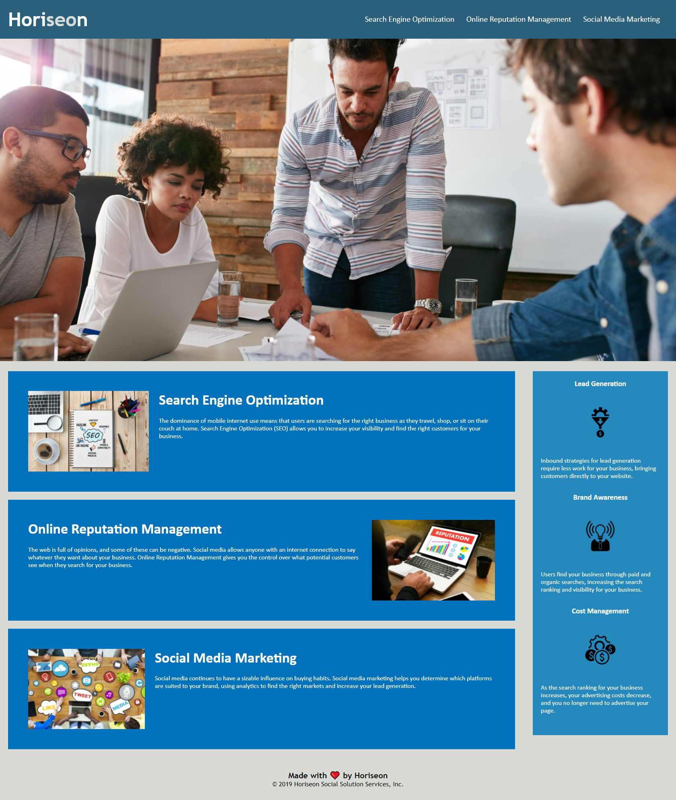

# Horiseon Landing Page

## Project Description

    This project was created at the client's request to refactor their webpage to increase accessibility and to improve SEO. In the process of reviewing and updating, efforts to clean up the code were implemented by merging redundant css, renaming semantic elements and adding reference notes to the html. The goal was to create the aforementioned points for review by the client to review and later merge to their live code. The specific concerns of the client were addressed by fixing the broken nav link and adding accessibility via alt tags, both of which will increase the SEO of the webpage. The tight relationship between html/CSS via adjustments and reconciling changes to "flow" between html and CSS held my attention and required the most problem solving. The client would need only merge the code updates to the live code after testing for bugs. As there were no testing branches on this project, that step is not applicable.

    The URL to the updated site: https://rosswestwater.github.io/Challenge1/

    Screenshot of the updated page:
     
